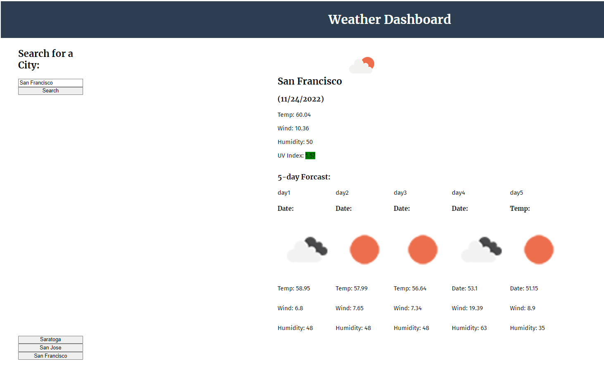

# Weather-Dashboard

## Weather dashboard to show the weather outlook for multiple cities

Using the [OpenWeather One Call API](https://openweathermap.org/api/one-call-api) to retrieve weather data for cities.

This app will run in the browser and feature dynamically updated HTML and CSS powered by jQuery.

## Contributions

Made by John Aslani

## License: MIT

This program licensed under [MIT](https://img.shields.io/badge/license-MIT-blue)

## Screenshot

## Link to deployed application

https://johnaslani.github.io/Weather-Dashboard/

## Questions

For further information see [my GitHub](https://github.com/johnaslani) or [Weather-Dashboard](https://github.com/johnaslani/Weather-Dashboard)

Should you have any questions, please reach me at [aslani.john@gmail.com](mailto:aslani.john@gmail.com)

